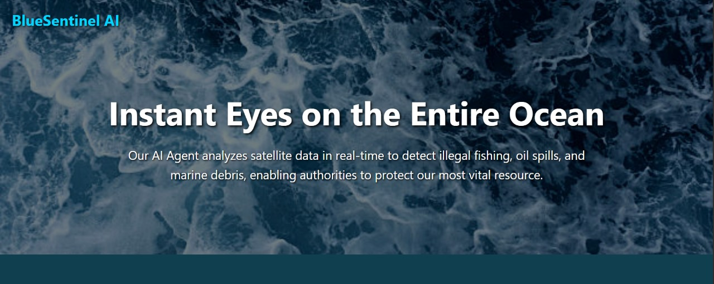
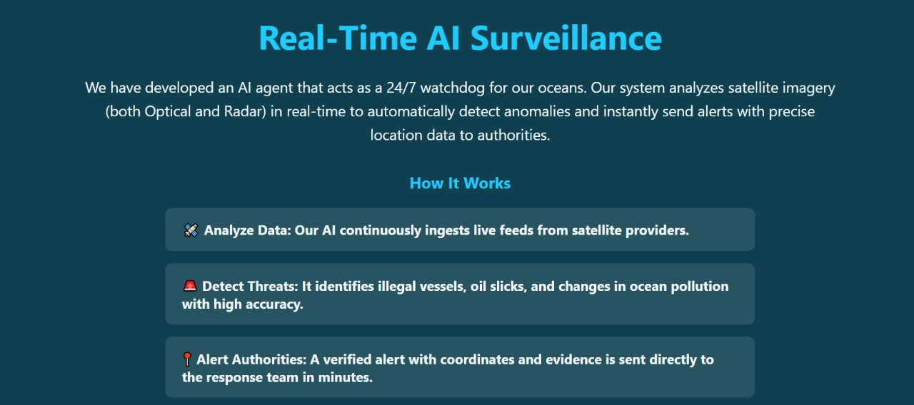

# Marine_Surveillance_AI

BlueSentinnel AI is a an AI agent that can do marine surveillance using live satellite image data. 
An integrated AI-powered system for **ocean monitoring** using satellite imagery.  
It detects:
- 🚢 **Illegal ships** in restricted maritime zones or Illegal Fishing vessels.
- 🛢️ **Oil spills**
- 🗑️ **Marine debris** (floating garbage)

Our current prototype uses .tif files of images and detects the above things, then finally sends alerts to the concerned authorities using Pushbullet notifications.
This project falls under the SDG 14 (Life Below Water) and SDG 13 (Climate Action). 
The system combines **remote sensing**, **deep learning**, and **geospatial analysis** with **Pushbullet alerts** for real-time notifications.

In this project the index.html is used for the frontend.

app.py is responsible for calling the detector.py files for each of the things. Please make sure that the file names of each of the detection filenames matches the name inside the app.py.
We have renamed the files for convenience of understanding. 

Please make sure to download the necessary requirements from the requirements.txt and also the necessary models that we have trained using google colab from the given drive link.

